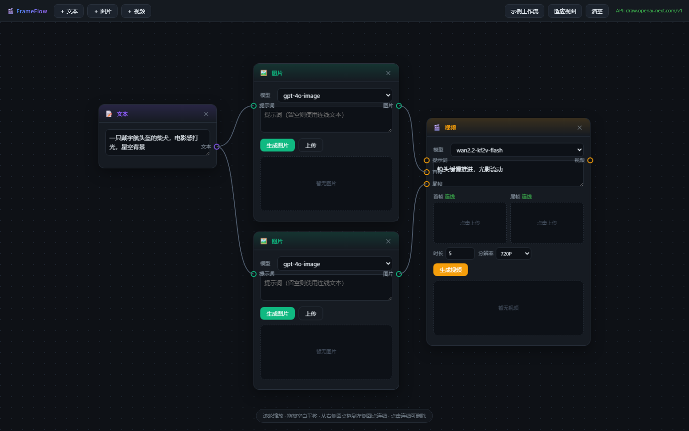

# FrameFlow · AI 图片/视频工作台

> 无限画布 + 节点连线的极简 AI 创作工作台，核心是 **首尾帧 → 视频**。



对标 TapNow 的极简版：**无限画布 + 节点连线**，核心是 **首帧/尾帧 → 视频** 的工作流。

## 快速开始

```bash
cd "D:/Codex-Workspace/Evomap Hackthon/Workbench"
python server.py
# 打开 http://127.0.0.1:8787
```

依赖已就绪（fastapi / uvicorn / requests / python-dotenv）。缺的话：
```bash
pip install -r requirements.txt
```

## 怎么用

1. 顶部 **＋文本 / ＋图片 / ＋视频** 添加节点。
2. 从节点右侧圆点拖到另一个节点左侧圆点即可连线：
   - `文本` → `图片` 的「提示词」
   - `文本` → `视频` 的「提示词」
   - `图片` → `视频` 的「首帧」/「尾帧」
3. 图片节点点 **生成图片**；视频节点点 **生成视频**。
4. 首尾帧也可以直接**点缩略图上传本地图片**（会自动转 base64，接口实测可用）。
5. 连线可点击删除；滚轮缩放，拖拽空白平移。

推荐首尾帧模型：`wan2.2-kf2v-flash`（便宜、支持首尾帧）。文本转视频用 `wan2.6-t2v`，图生视频用 `wan2.2-i2v-flash`。

## 后端接口（已实测）

| 能力 | 请求 | 说明 |
| --- | --- | --- |
| 生图 | `POST /v1/chat/completions` | `model=gpt-4o-image`，返回 markdown 图片链接 |
| 生图 | `POST /v1/images/generations` | `model=gpt-image-*` |
| 生视频 | `POST /v1/video/generations` | `{model, prompt, images:[首帧,尾帧], duration, resolution}` |
| 查任务 | `GET /v1/tasks/{task_id}` | 返回 `status / progress / result_url` |

后端把上面的调用封装成：
- `POST /api/image`  `{prompt, model, mode}`
- `POST /api/video`  `{prompt, model, images, duration, resolution}`
- `GET  /api/tasks/{id}`
- `GET  /api/proxy?url=...`  下载代理

## 目录

```
Workbench/
├─ server.py            # FastAPI 后端 + 静态托管
├─ .env                 # VECTRUST_BASE_URL / VECTRUST_API_KEY
├─ requirements.txt
└─ static/
   ├─ index.html
   ├─ style.css
   └─ app.js            # 画布 / 节点 / 连线 / 生成逻辑
```

## 继续开发的小提示

- 模型清单在 `server.py` 顶部的 `IMAGE_MODELS` / `VIDEO_MODELS`，前端是 `datalist`，可直接手输任意模型 id。
- 想加节点类型：在 `static/app.js` 的 `NODE_DEFS` 加定义，再写对应的 `bodyHTML` 分支。
- 想改请求参数：`server.py` 里 `ImageRequest` / `VideoRequest` 的 `extra` 字段可以透传任意额外 JSON。
- 布局/节点状态存在浏览器 `localStorage`（key: `frameflow.state.v1`）。
